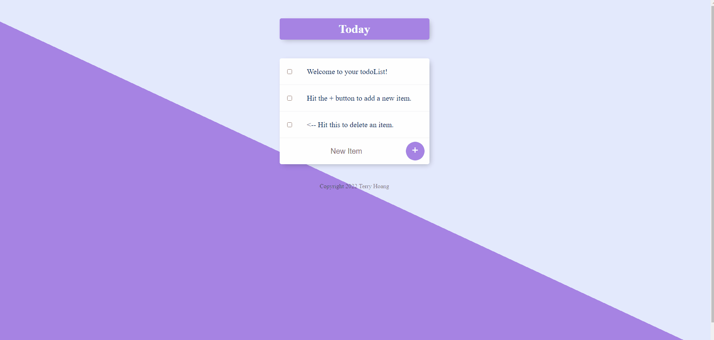

# Todo List Web Application

This is a Node.js web application that allows users to create and manage to-do lists. The application uses MongoDB as the database and Mongoose to model the application data.


## Installation

Before running the application, please make sure that you have Node.js and MongoDB installed on your system.

1. Clone this repository or download the ZIP file and extract it.
2. Open your terminal or command prompt and navigate to the directory where you have the project files.
3. Install the required dependencies by running the following command:

```bash
npm install
```

## Usage
To run the application, enter the following command in your terminal:
```bash
node app.js
```
Then, open your web browser and navigate to http://localhost:3000/ to see the application in action.
## Features
The application has the following features:

1. Create a new task
2. View a list of all tasks
3. Delete a task
4. Create custom lists to group tasks
